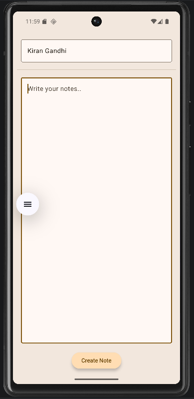
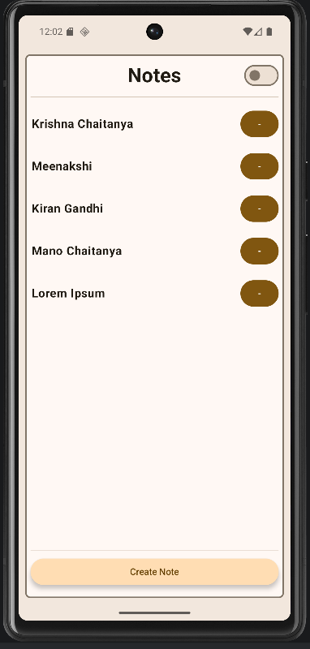
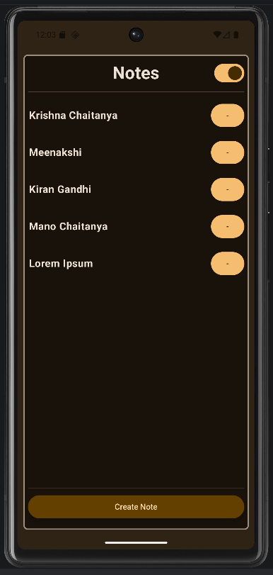

# NotesApp

A notes app built with Jetpack Compose, following MVVM architecture with Room persistence.
Built as part of a structured Android development learning plan.

## Features
- Create, view, edit, and delete notes
- Swipe-to-delete via Material3 `SwipeToDismissBox`
- List → detail navigation with nav arguments
- Light/dark theme toggle (Material3)
- Configuration-change-safe (rotation)
- Full local persistence — data survives app restart (Room DB)

## Architecture
- **MVVM**: `NotesViewModel` exposes `StateFlow<List<Note>>`, backed by `stateIn` with `WhileSubscribed(5000L)` for lifecycle-aware, production-correct state sharing
- **Room persistence**: `Note` entity, `NotesDao` (insert/update/delete/query), `NotesDatabase` singleton
- **Repository pattern**: `NotesRepository` interface decouples ViewModel from Room, enabling swappable data sources and isolated ViewModel testing
- **Composition root**: `NotesApplication` owns Room/Repository construction — `MainActivity` and all Composables have zero direct Room/DAO dependencies
- **Navigation Compose**: note ID passed via nav argument (`Display/{id}`), detail screen re-derives state from ViewModel — no duplicated state

## Screens
| Screen | Route | Description |
|---|---|---|
| Notes | `Notes` | List all notes, tap to view, swipe to delete |
| Create | `Create` | Add a new note |
| Display | `Display/{id}` | Full note view, edit existing note |

## Tech stack
Kotlin · Jetpack Compose · Material3 · Navigation Compose · Room · StateFlow · Coroutines

## Status
- ✅ Week 11 complete — full CRUD with Room persistence, clean MVVM layering enforced
- 🔜 Week 12 begins a separate To-Do app repo — this repo continues evolving independently

## Screenshots
- 

- 
